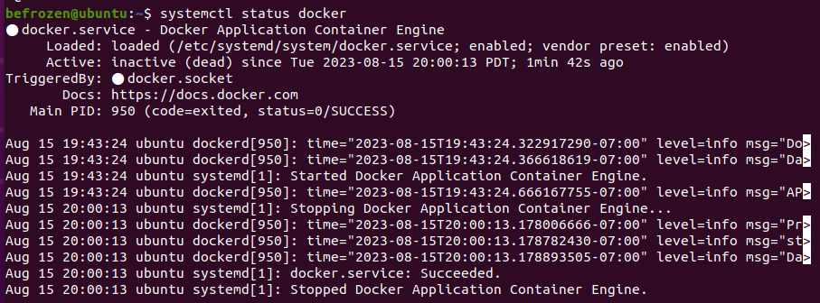
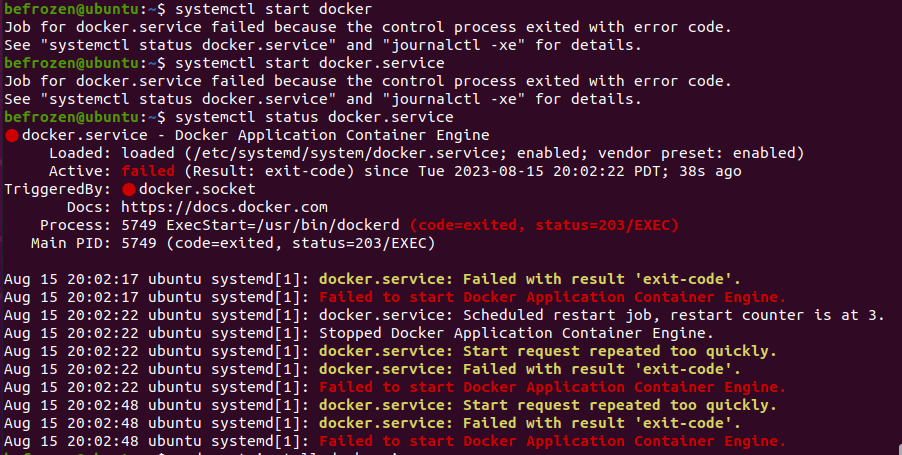

# Debugs

#### Can't import docker

`systemctl status docker`

check status you may see something like this:

`systemctl start docker`

you will fail EVERYTIME

`sudo apt install docker.io`

`sudo dockerd --debug`

`systemctl stop docker`

then restart, it will work.

**DON'T DO**

`sudo rm -rf /var/run/docker.pid` 

This will uninstall Docker Desktop on your computer.

#### docker ps

Cannot connect to the Docker daemon at unix:///home/befrozen/.docker/desktop/docker.sock. Is the docker daemon running?

check if you have installed docker desktop